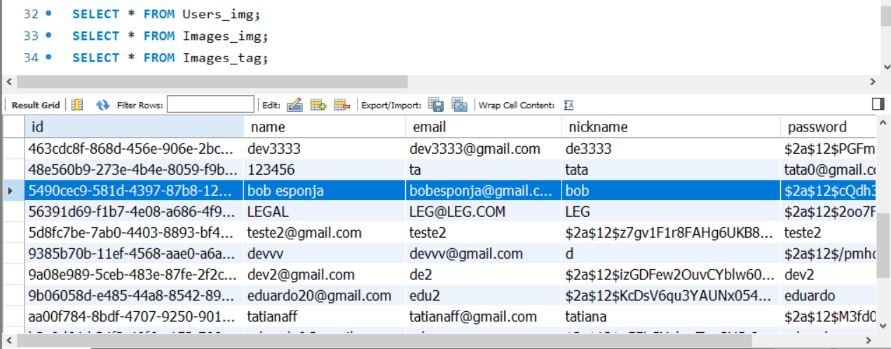

<h1 align="center">
🎨🎨🎨 Labephoto-Frontend - PROJETO FULL STACK
</h1>

<p>
 Status do Projeto: Em desenvolvimento :warning:
 > O que falta?
 - Finalizar o endpoint de criar imagem;
 - Fazer o endpoint de pegar uma imagem pelo ID: fazer modal com detalhes de cada imagem ao clicar;
</p>

# Indice

- :rocket: [Sobre o Projeto](#rocket-sobre-o-projeto)
- 👨‍💻️ [Tecnogias utilizadas](#%EF%B8%8F-tecnogias-utilizadas)
- 📦️ [Como utilizar o projeto](#%EF%B8%8F-como-utilizar-o-projeto)


---

## :rocket: Sobre o Projeto

 O objetivo do projeto era construir uma plataforma de gerenciamento de imagens, nos caso, mais especificamente, uma galeria de artes. 

Este projeto de Front-end Web foi desenvolvido em ReactJS com JS.

---

## 👨‍💻️ Tecnogias utilizadas

O projeto foi desenvolvido utilizando as seguintes tecnologias:

- [ReactJS](https://reactjs.org/)

### Dependências

- [React Router DOM](https://github.com/ReactTraining/react-router#readme)
- :nail_care: [Material UI](https://material-ui.com/)


### IDE

- [Visual Studio Code](https://code.visualstudio.com/)

---

## 📦️ Como utilizar o projeto

Para copiar o projeto, utilize os comandos:

```bash
  # Clonar o repositório
  ❯ git clone https://github.com/TatianaFischer/Labephoto-Frontend.git

  # Entrar no diretório
  ❯ cd Labephoto-Frontend
```

Para instalar as dependências e iniciar o projeto, você pode utilizar o Yarn ou NPM:

**Utilizando yarn**

```bash
  # Instalar as dependências
  ❯ yarn

  # Iniciar o projeto
  ❯ yarn dev:server
```

**Utilizando npm**

_PS: Caso utilize o NPM, apague o arquivo `yarn.lock` para ter todas as dependências instaladas da melhor forma._

```bash
  # Instalar as dependências
  ❯ npm install

  # Iniciar o projeto
  ❯ npm start
```


## 🚀 Projeto no ar
http://labephoto.surge.sh/

<p>
---
   
---
<h6> BANCO DE DADOS: </h6>
---

--- 
</p>
<h4 align="center">
  Feito com por Tatiana Fischer 👋️
</h4>
